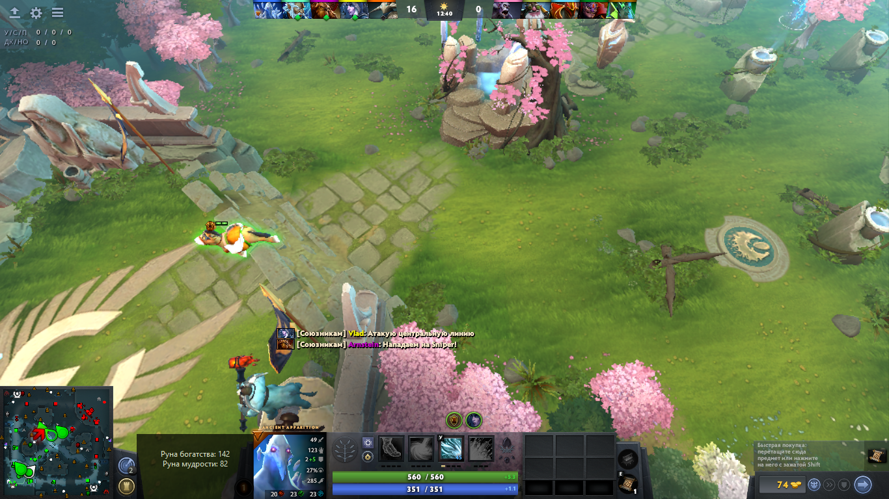

# Dota2 контроль рун
Если хотите лучше контролировать руны, то возможно эта программа вам поможет. Она выводит дополнительное окно, в котором отображается информация о появлении рун. Окно в виде оверлея, т.е. отображается по верх игры, возможно потребуется позиционирование (это можно сделать в файле overlay.py).

На данный момент реализован контроль двух рун (богатства, мудрости), пример ниже

## Как запустить
1. Загрузить проект, распаковать в каталог
2. Перейти в распакованный каталог
3. Создать или активировать [виртуально окружение](#виртуально-окружение)
4. Установить зависимости pip install -r requirements.txt
5. Создать в *\SteamLibrary\steamapps\common\dota 2 beta\game\dota\cfg каталог gamestate_integration и создать в нем файл [gamestate_integration_monitor.cfg](./assets/gamestate_integration_monitor.cfg) либо взять из проекта
6. Запустить сервер src/server.py, работает на 3000 порту если занят то указать другой. Только не забудьте поменять порт в файле [gamestate_integration_monitor.cfg](./assets/gamestate_integration_monitor.cfg). В src/server.py И gamestate_integration_monitor.cfg порты должны совпадать.
7. Запускаем Dota2
8. Запускаем основную программу src/main.py, должно появится окно
9. Начните игру.

Порядок запуска:

    python.exe ./src/server.py
    запуск Dota2 через steam
    python.exe ./src/main.py

## Виртуально окружение
    python -m venv venv
    source venv/bin/activate  # macOS/Linux
    venv\Scripts\activate     # Windows